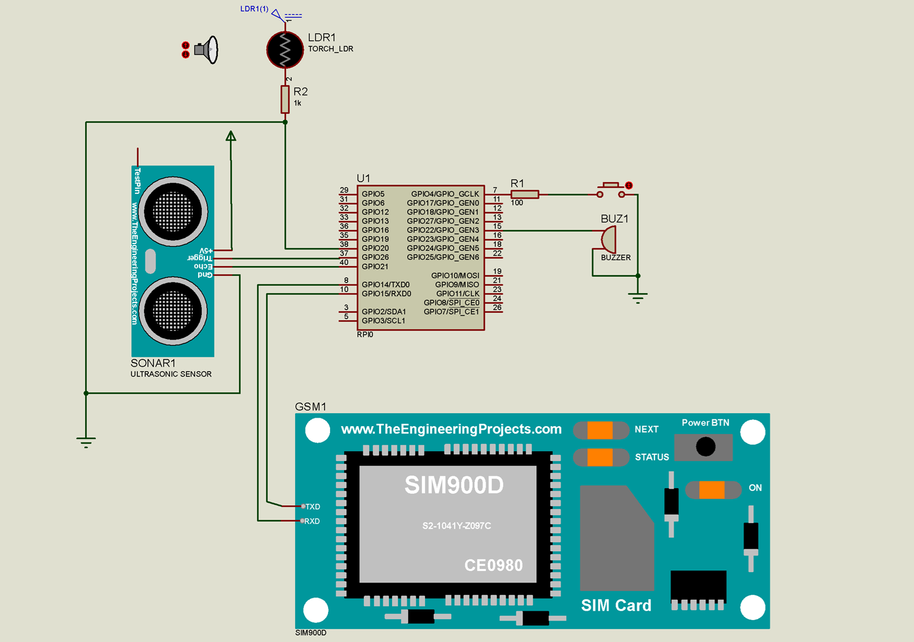

# Assistive Obstacle Detection System

This MicroPython-based project uses ultrasonic sensors, a light sensor, and GSM messaging to assist visually impaired individuals in navigating environments and sending emergency alerts.

## 📦 Features

- Obstacle detection using 3 ultrasonic sensors
- Vibration feedback based on proximity
- Light intensity sensing with LDR
- Emergency help button that sends a location SMS via GSM (SIM800L)
- Compatible with Raspberry Pi Pico or similar microcontrollers

## 🔧 Hardware Used

- Raspberry Pi Pico
- 3x HC-SR04 Ultrasonic Sensors
- 1x LDR (Light Sensor)
- 1x Vibration Motor
- 1x SIM800L GSM Module
- Push Button

## 🧠 Functional Highlights

- Vibrates based on direction and proximity of obstacles (left, right, forward)
- Sends emergency SMS with Google Maps location link when help button is pressed
- Adjusts behavior based on surrounding light intensity

## 💬 Example SMS Sent
HELP ME, LOCATION: https://www.google.com/maps/@-0.7161091,37.1469624,17z?authuser=0&entry=ttu

## 🧪 Circuit Simulation

Below is the simulation diagram of the assistive system, showing the connection between:
- Raspberry Pi Pico
- Ultrasonic distance sensor
- LDR
- SIM800L GSM module
- Buzzer and help button

The system logic was tested using Proteus simulation software to verify the real-world response before hardware implementation.

## 📂 Files

- `assistive_system.py` — Main MicroPython code
- `assistive_system_simulation.png` - Assistive System Simulation
## 👨‍💻 Author

[Nehemiah Kipkoech Kimutai](https://github.com/Nemick)
